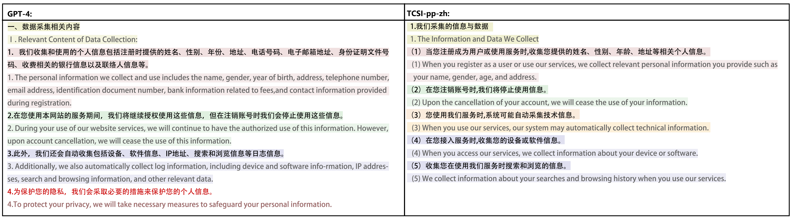

# CAPP-130: A Corpus of Chinese Application Privacy Policy Summarization and Interpretation.

## Introduction
A privacy policy serves as an online internet protocol crafted by service providers, which details how service providers collect, process, store, manage, and use personal information when users engage with applications.
However, these privacy policies are often filled with technobabble and legalese, making them 'incomprehensible'.
As a result, users often agree to all terms unknowingly, even some terms may conflict with the law, thereby posing a considerable risk to personal privacy information.
To tackle these challenges, we introduce a fine-grained CAPP-130 corpus and a TCSI-pp framework. 
CAPP-130 contains $130$ Chinese privacy policies from popular applications that have been carefully annotated and interpreted by legal experts, resulting in $52,489$ annotations and $20,555$ rewritten sentences.
TCSI-pp first extracts sentences related to the topic specified by users and then uses a generative model to rewrite the sentences into comprehensible summarization. Built upon TSCI-pp, we construct a summarization tool TSCI-pp-zh by selecting RoBERTa from six classification models for sentence extraction and selecting mT5 from five generative models for sentence rewriting.

## Environment

Project dependencies can be installed in the following ways:

```
pip install -r requirements.txt
```
Equipment: A100 *2

## Chinese Application Privacy Policy Corpus (CAPP-130)

CAPP-130 contains $130$ Chinese privacy policies from popular applications that have been carefully annotated and interpreted by legal experts, resulting in $52,489$ annotations and $19,570$ rewritten sentences.

###  Basic Statistics of Corpus CAPP-130

The guide for [Paper](Documents) and Annotation Guidelines ([Chinese version](Documents/Annotation_Guidelines_Chinese_Version.pdf), [English version](Documents/Annotation_Guidelines_English_Version.pdf)) explains the tags and the process of annotation, which can be found in the Documents. 
Currently, the Annotation Guidelines are available only in Chinese, but we are working on translating them into English.
Table 1 shows the basic statistical information of CAPP-130, and Table 2 shows the pre-sliced data information used for TCSI-pp. They are stored in the CAPP-130 Corpus.

Table 1: Basic Statistics of Corpus CAPP-130.
| Data Practice Categories     | Quantity | Percentage (\%) | Median  | Mea |
|------------------------------|----------|-----------------|---------|----|
| Information Collection       | 6967     | 17.9            | 58      | 70 |
| Permission Acquisition       | 1852     | 4.8             | 54      | 62 |
| Sharing and Disclosure       | 4740     | 12.2            | 52      | 63 |
| Usage                        | 3589     | 9.2             | 64      | 75 |
| Storage                      | 1360     | 3.5             | 41      | 46 |
| Security Measures            | 3000     | 7.7             | 53      | 60 |
| Special Audiences            | 1416     | 3.6             | 54      | 60 |
| Management                   | 5324     | 13.7            | 43      | 49 |
| Contact Information          | 712      | 1.8             | 41      | 54 |
| Authorization and Revisions  | 1049     | 2.7             | 35      | 43 |
| Cessation of Operations      | 110      | 0.3             | 64      | 68 |
| Important                    | 20555    | 52.8            | 52      | 61 |
| Risks                        | 1815     | 4.7             | 40      | 46 |


Table 2: The pre-sliced data from CAPP-130 is used to train TCSI-pp.
| sub dataset                       | train samples | validation samples | test samples |
|----------------------------------|---------------|--------------------|--------------|
| important_identification_dataset | 27222         | 5833               | 5834         |
| risk_identification_dataset      | 14338         | 3083               | 3084         |
| topic_identification_dataset     | 14190         | 3043               | 3035         |
| rewritten_sentences              | 15656         | 1957               | 1957         |


## Topic-Controlled Framework for Summarization and Interpretation of Privacy Policy (TCSI-pp)

we provide a Topic-Controlled Framework for Summarization and Interpretation of Privacy Policy (TCSI-pp). Unlike previous methods that only extract specific sentences, TCSI-pp first retrieves relevant sentences based on the topics chosen from data practice categories by users using a classification model. Then, a generative model is used to rewrite these sentences clearly and concisely for the understanding of the general public, with potentially risky sentences emphasized.

### Information Extraction

These are specifically utilized for binary classification models such as "Important Identification" and "Risk Identification", as well as multi-classification models like "Topic Identification".

#### How to use


The model is placed in the XXX_pretain (where XXX is the model name) directory and each directory contains three files:
 - pytorch_model.bin  
 - bert_config.json  
 - vocab.txt  

Pre-trained model download address from [here](https://github.com/huggingface).   

After decompression, put it in the corresponding directory according to the above, and confirm the file name is correct. 

We have independently acquired three sets of classification benchmarks from six different models: RoBERTa, BERT, mBERT, sBERT, Pert, and ERNIE. 

You can be used in the following ways:
```
# Train and test binary classification model:
python run.py --model 'model_name' --data 'data_name'

# Train and test multi-classification model:
python run_multi.py --model 'model_name' --data 'data_name'
```
Please note that the above code examples are for illustrative purposes only and you may need to make appropriate adjustments based on your specific situation.

#### Baselines

We provide classification baselines for "Important Identification", "Risk Identification", and "Topic Identification". They are respectively trained and tested on the 'important_identification_dataset', 'risk_identification_dataset', and 'topics_identification_dataset' in the sub-dataset. Table 3 displays the evaluation metrics of six models.

Table 3: Evaluation Metrics with F1 for Classification Models.
| Methods          | topic-Micro | topic-Macro  | important-Micro | important-Macro  |risk-Micro | risk-Macro  |
|------------------|------------|----------|----------|------|------|------|
| RoBERTa |**0.819**|**0.841**|**0.897**|**0.899**|0.920	| 0.711|
|Bert	|0.802	 |0.820	|0.895    |0.896    |0.921	|0.719|
|mBERT	|0.809	 |0.821   |0.889    |0.889    |0.918 	|0.709 |
|SBERT	|0.781  |0.794 	| 0.875    |0.874    |0.917	|0.689|
|PERT	|0.801	 |0.812	| 0.895    |0.897    |**0.922**	|**0.716**|
|ERNIE	|0.807	 |0.821	| 0.895    |0.896    |0.921	| 0.702|

**(New)** We will upload all model parameters to [here](https://huggingface.co/EnlightenedAI/TCSI_pp_zh/tree/main).

### Rewritten Sentences
A generative model is used to rewrite these sentences clearly and concisely for the understanding of the general public, with potentially risky sentences emphasized.

#### How to use
For rewriting sentences, we fine-tuned the following models based on the transformer encoder-decoder architecture: mT5, Bert2Bert, Bert2gpt, RoBerta2gpt, and ERNIE2gpt. These models were initialized with parameters from publicly available models, such as mT5-small, Bert-base-Chinese, ernie-3.0-base-zh, chinese-roberta-wwm-ext, and gpt2-base-chinese. These models can be found on [Hugging Face](https://huggingface.co/) model repository.

You can be used in the following ways:
```
# train and test:
python model_name.py
#The model_name needs to be changed to mT5, Bert2Bert, Bert2gpt, RoBerta2gpt, or ERNIE2gpt.
```
Please note that the above code examples are for illustrative purposes only and you may need to make appropriate adjustments based on your specific situation.

#### Baselines
Table 4 displays the ROUGE, Bert-score, Bart-score, and Carburacy evaluation metrics for these models:

Table 4: Evaluation metrics for the rewrite models.
| Methods      | rouge-1 | rouge-2 | rouge-l  | Bert-score | Bart-score | Carburacy |
|--------------|-------|-------|----------|----------|------------|-----------|
| mT5         | **0.753** | **0.609** | **0.733**    | **0.888**    | **-4.577**     | **0.833**     |
| RoBERTa2gpt  | 0.749	|0.577	| 0.719    | 0.872    | -4.975     | 0.755     |
| Bert2bert    | 0.718	|0.535	| 0.689    | 0.864    | -5.020     | 0.747     |
| Bert2gpt     | 0.751	|0.574	| 0.720    | 0.872    | -4.964     | 0.764     |
| ERNIE2gpt    | 0.623	|0.406	| 0.581    | 0.809    | -5.716     | 0.715     |

**(New)** We will upload all model parameters to [here](https://huggingface.co/EnlightenedAI/TCSI_pp_zh/tree/main).

## Chinese application privacy policy summary tool (TCSI-pp-zh)

we select the most effective RoBERTa and mT5 to implement the Chinese application privacy policy summary tool (TCSI-pp-zh). Experiments on real privacy policies show that TCSI-pp-zh is superior over GPT-4 and other models, demonstrating higher readability and reliability in the task of summarizing Chinese application privacy policies.

### How to use

You can be used in the following ways:
```
# train and test:
python ./TCSI_pp_zh/TCSI_pp_zh.py --binary_model 'binary_model_name' --multi_model 'multi_model_name'  --rewrite_model 'rewrite_model_name' --topic_list 'choose_a_topic_list'  --data 'a_privacy_policy'
```

Please note that the above code examples are for illustrative purposes only and you may need to make appropriate adjustments based on your specific situation.

### Effect Demonstration
Figure 1 displays the summarization of GPT-4 and TCSI-pp-zh in a privacy policy, where text having the same background color represents descriptions of the same part of the privacy policy generated by different algorithms; red text emphasizes incorrect content produced in the summary.

Figure 1: Summarization of GPT-4 and TCSI-pp-zh.


## citation
If you use the data or code of this project, or if our work is helpful to you, please state the citation
```
@inproceedings{
zhu2023capp,
title={{CAPP}-130: A Corpus of Chinese Application Privacy Policy Summarization and Interpretation},
author={Pengyun Zhu and Long Wen and Jinfei Liu and Feng Xue and Jian Lou and Zhibo Wang and Kui Ren},
booktitle={Thirty-seventh Conference on Neural Information Processing Systems Datasets and Benchmarks Track},
year={2023},
url={https://openreview.net/forum?id=OyTIV57Prb}
}
```
## Update
We will continue to update this repository on GitHub.

